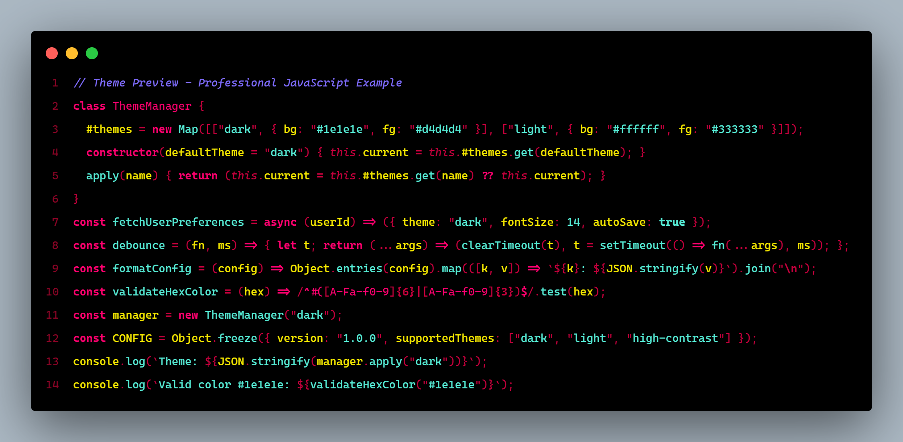

# 🌃 CyberUI: The Ultimate Cyberpunk Experience for VS Code

[](https://marketplace.visualstudio.com/items?itemName=aarweb.cyberui)
[](https://marketplace.visualstudio.com/items?itemName=aarweb.cyberui)
[](https://marketplace.visualstudio.com/items?itemName=aarweb.cyberui)

> **Transform your code editor into a futuristic neon-lit terminal.** CyberUI is the best **dark theme** for developers who love **cyberpunk aesthetics**, **synthwave vibes**, and **high contrast colors**. Designed for **immersive dark mode** coding with carefully balanced **neon glow** colors (cyan, magenta, electric yellow) that reduce **eye-strain** during those late-night programming sessions. Whether you're a hacker, a night owl coder, or simply want the most beautiful **futuristic theme** for VS Code—CyberUI delivers the ultimate visual experience.

---

## 🖼️ Preview


_CyberUI theme featuring vibrant neon syntax highlighting on pure black background_

---

## ⚡ Why CyberUI?

| Benefit                      | Description                                                              |
| ---------------------------- | ------------------------------------------------------------------------ |
| 👁️ **Reduces Eye Strain**    | Carefully balanced contrast ratios designed for extended coding sessions |
| 🎯 **Perfect for Debugging** | High contrast colors make it easy to spot errors and navigate code       |
| 🌙 **Night Mode Optimized**  | Pure black background (#000000) for OLED screens and dark environments   |
| 🎨 **Neon Glow Aesthetic**   | Vibrant cyberpunk colors inspired by Cyberpunk 2077 and synthwave art    |
| ⚡ **Zero Distractions**     | Clean UI elements that keep you focused on your code                     |
| 🔋 **Battery Friendly**      | True black background saves battery on OLED/AMOLED displays              |

---

## 💻 Optimized For

CyberUI provides **enhanced syntax highlighting** for the most popular programming languages and frameworks:

- ✅ **JavaScript** / **TypeScript**
- ✅ **React** / **Vue** / **Angular**
- ✅ **Python**
- ✅ **Rust**
- ✅ **Go**
- ✅ **C** / **C++**
- ✅ **HTML** / **CSS** / **SCSS**
- ✅ **JSON** / **YAML** / **Markdown**
- ✅ **PHP** / **Ruby**
- ✅ **Java** / **Kotlin**
- ✅ **Shell** / **Bash**

---

## 🚀 Installation

### From VS Code Marketplace (Recommended)

1. Open **VS Code**
2. Go to **Extensions** (`Ctrl+Shift+X` / `Cmd+Shift+X`)
3. Search for **"CyberUI"**
4. Click **Install**
5. Press `Ctrl+K Ctrl+T` and select **CyberUI**

### From Command Line

```bash
code --install-extension aarweb.cyberui
```

### Manual Installation

1. Download the latest `.vsix` from [GitHub Releases](https://github.com/aarweb/cyberui/releases)
2. Run: `code --install-extension cyberui-x.x.x.vsix`

---

## 🎨 Color Palette

| Color              | Hex       | Usage                   |
| ------------------ | --------- | ----------------------- |
| 🔷 Optical Cyan    | `#55EAD4` | Primary text, variables |
| 💗 Pink Neon       | `#FF006E` | Keywords, functions     |
| 💛 Electric Yellow | `#F3E600` | Strings, warnings       |
| ❤️ Trauma Red      | `#C5003C` | Errors, important       |
| 🖤 Void Black      | `#000000` | Background              |

---

## 🤝 Contributing

Found a bug or have a suggestion? Feel free to [open an issue](https://github.com/aarweb/cyberui/issues) or submit a pull request!

---

## 📄 License

[GPL-3.0](./LICENSE) © [aarweb](https://github.com/aarweb)

---

**🌃 Welcome to the future of coding. Welcome to CyberUI.**
